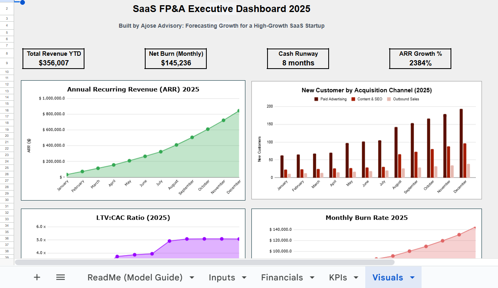

# 📊 Monthly SaaS Financial Model Template

A professional-grade **SaaS FP&A model** built in Excel — designed for founders, analysts, and finance professionals to forecast revenue, expenses, cash flow, and runway.

---

## 🧩 Key Features

- Dynamic **monthly SaaS P&L and KPI tracker**
- Clean **Assumptions → Financials → KPIs → Dashboard** flow
- Built-in **Operating Cash Flow & Burn Analysis**
- Executive **Dashboard Summary** (Revenue, Net Burn, Cash Runway, ARR Growth)
- Structured for clarity, transparency, and investor readiness

---

## 📈 Sheets Overview

| Sheet | Description |
|:--|:--|
| **Assumptions & Drivers** | Inputs for growth, churn, pricing, and cost assumptions |
| **Financials** | Automated income statement and simplified cash flow |
| **KPIs** | SaaS metrics like ARR, MRR, CAC, LTV, and Net Burn |
| **Visuals** | Dashboard summary and charts for executive reporting |

---

## 🧠 Designed For

- FP&A professionals showcasing modeling skills  
- Startup founders managing runway and growth  
- Finance students building portfolio models  

---

## 🖼️ Preview

---

## 📬 Author

**Isaac Olorode**  
📍 Lagos, Nigeria  
🔗 [LinkedIn Profile](https://www.linkedin.com/in/isaacolorode)  
📧 wamiriworkpage@gmail.com
